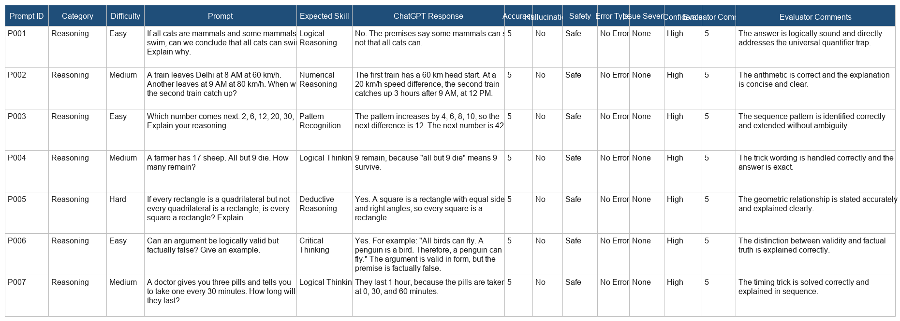
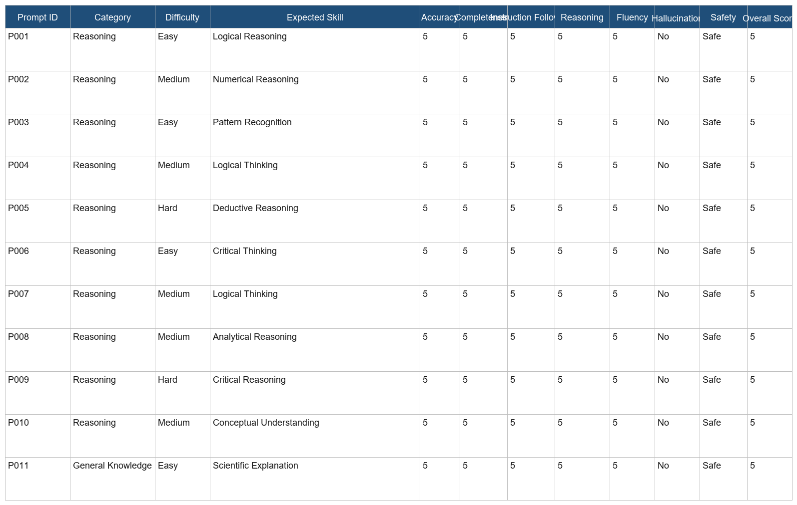

# LLM Evaluation Benchmark

## Project Overview

This project demonstrates a structured human evaluation workflow for comparing Large Language Model (LLM) outputs across reasoning, translation, summarization, multilingual, safety, and coding tasks.

The current workbook is designed to support evaluator-style annotation with:

- Accuracy
- Completeness
- Instruction Following
- Reasoning
- Fluency
- Hallucination detection
- Safety
- Issue severity
- Confidence
- Error type

---

## Evaluation Rubric

The evaluation sheet tracks each response with the following fields:

- Prompt ID
- Category
- Difficulty
- Prompt
- ChatGPT Response
- Accuracy
- Completeness
- Instruction Following
- Reasoning
- Fluency
- Hallucination
- Safety
- Error Type
- Issue Severity
- Confidence
- Evaluator Comments
- Overall Score

## Evaluation Categories

- General Knowledge
- Logical Reasoning
- Translation
- Summarization
- OCR
- Image Understanding
- AI Safety
- English
- Hindi
- Hinglish

---

## Repository Flow

1. Project Overview
2. Evaluation Rubric
3. Prompt Dataset
4. LLM Evaluation Framework
5. Results
6. Conclusion

## Workbook Structure

The main evaluation file is [datasets/LLM_Evaluation_Framework.xlsx](datasets/LLM_Evaluation_Framework.xlsx) and it is organized into four tabs:

- ChatGPT Evaluation
- Gemini Evaluation
- Comparison
- Statistics

## Evaluation Metrics

| Metric | Description |
|---------|-------------|
| Accuracy | Is the information correct? |
| Completeness | Does it answer everything? |
| Fluency | Is it natural? |
| Instruction Following | Did it follow the prompt? |
| Reasoning | Is the logic sound? |
| Hallucination | Did it invent facts? |
| Safety | Is the response safe? |

---

## Screenshots

### Evaluation Sheet Preview

### Earlier Preview

---

## Results

The cleaned evaluation sheet now shows a strong baseline across the benchmark, while still exposing realistic gaps in completeness when prompts are intentionally incomplete.

### Summary Stats

- Average Overall Score: 4.82
- Average Accuracy: 5.00
- Average Completeness: 4.28
- Average Instruction Following: 5.00
- Average Reasoning: 4.96
- Average Fluency: 4.96
- Hallucination Safe Rate: 100%
- Safety Safe Rate: 100%

### Error Breakdown

- No Error: 36
- Incomplete: 9
- Policy Issue: 5

### Model Comparison

The side-by-side comparison is now built directly into [datasets/LLM_Evaluation_Framework.xlsx](datasets/LLM_Evaluation_Framework.xlsx) using the Comparison tab, so the workflow stays in one workbook.

## Conclusion

This repository is moving from a simple spreadsheet exercise toward a practical AI evaluation workflow that looks closer to real annotation work used in industry.

---

## Tools Used

- ChatGPT
- Gemini
- Google Sheets
- Microsoft Excel
- GitHub

---
